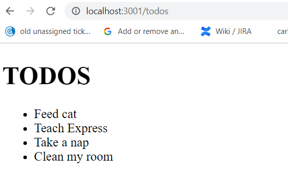

# unit-2-basic-todos

<b><u>STEP 1: Preparation:<b><u>

1. Clone this repo using "git clone https://github.com/alexanderghose/unit-2-basic-todos.git"
2. cd into the "intro-express" folder
3. do "npm install" to install the dependencies from package.json
4. open the "intro-express" folder with VSCode
5. open a terminal in vscode, and type "nodemon" to run the server
6. In the browser, go to localhost:3000/todos to see a list of todos like this:

<b><u>STEP 2: Task:</b></u>

You have two options

(A) Make a new project using the express generator, and create the necessary routers, controllers, and views. When the user goes to localhost:3000/todos, they must see a list of todos just as the picture above.

OR

(B) Refactor the code in this folder using the instructions <a href="https://git.generalassemb.ly/sei-toronto/SEI-35-7/blob/master/w04/d2/express-routers-controllers/express-routers-controllers.md#to-do-refactor">here</a>.
